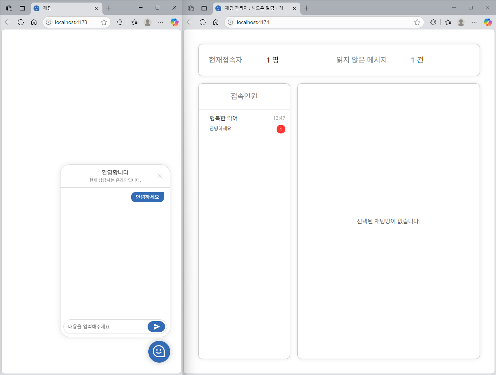
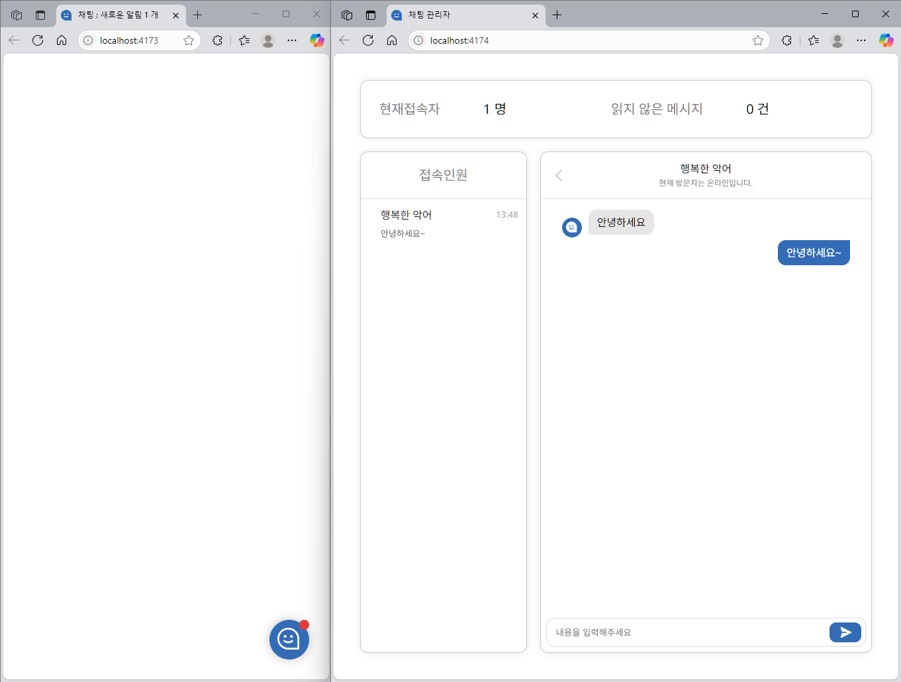
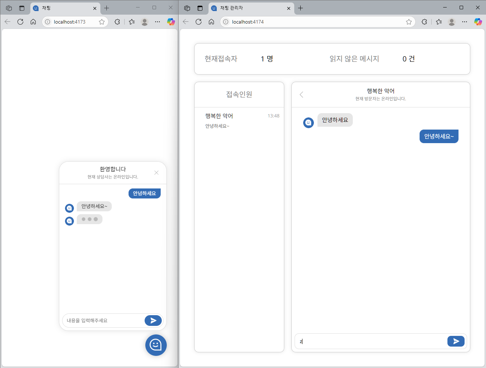
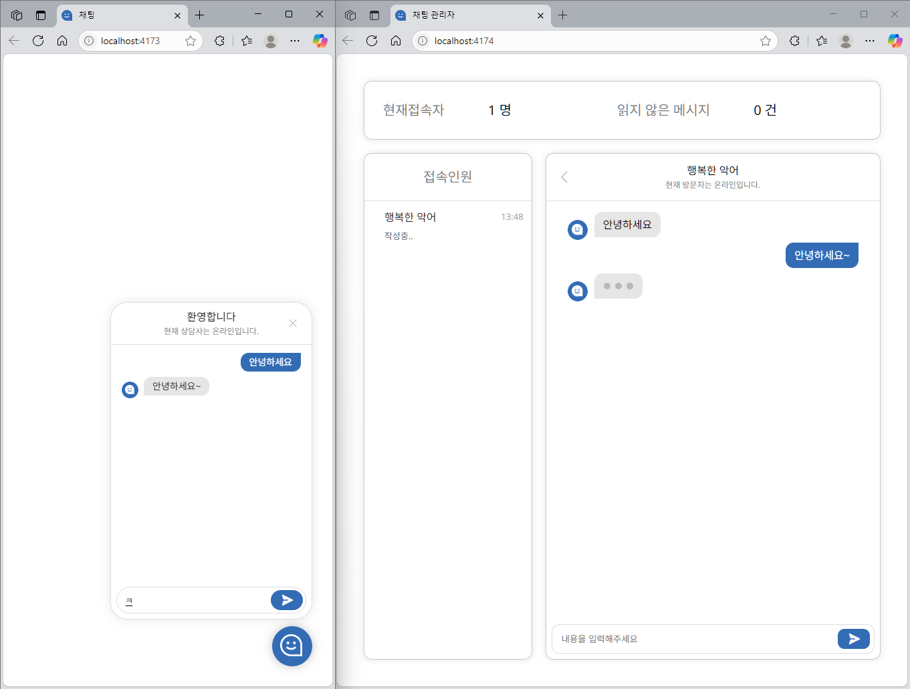
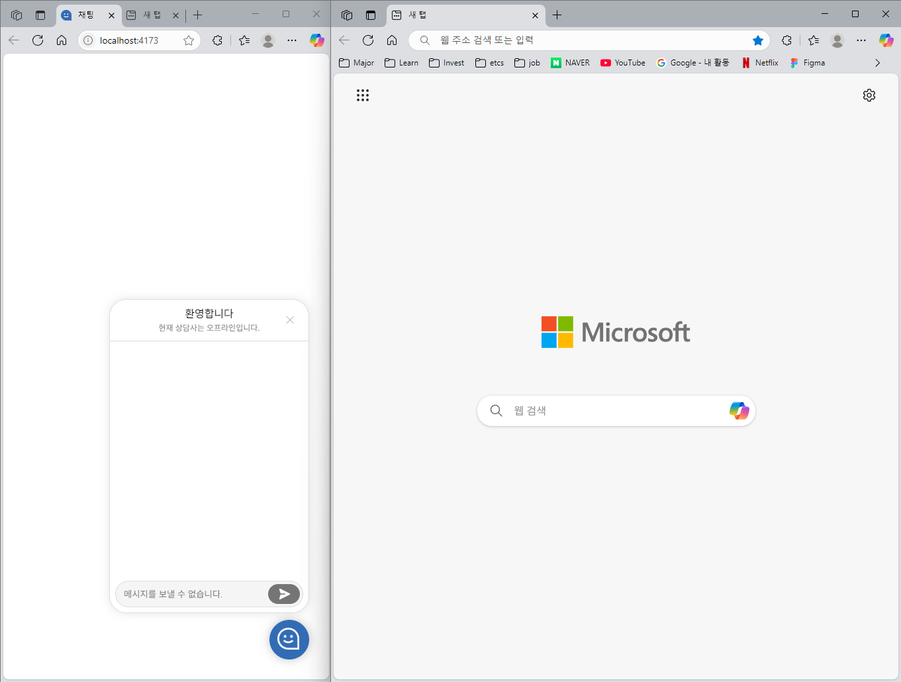
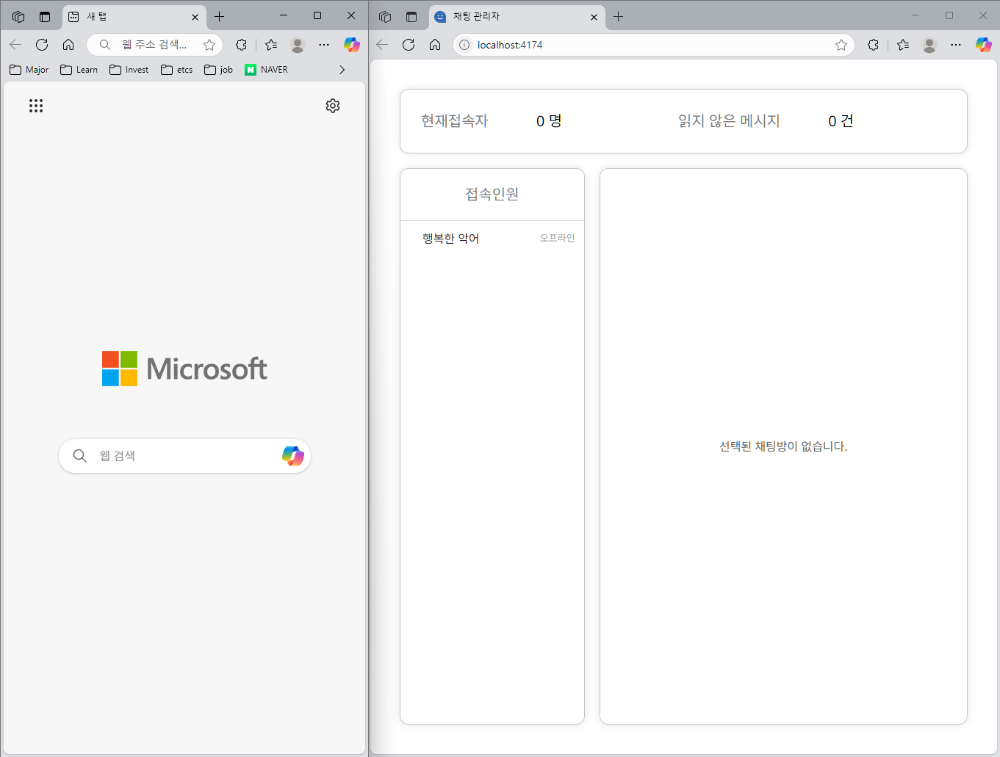

# 실시간 채팅 웹 애플리케이션

이 프로젝트는 `Supabase Realtime`을 활용한 **실시간 채팅 웹 애플리케이션**입니다.  
실시간 채팅은 역할에 따라 [관리자 전용](https://github.com/inseong01/realtime-chat-admin)과 [방문자 전용](https://github.com/inseong01/realtime-chat-client)으로 나뉘어 제공됩니다.

현재 저장소는 초기 작업 버전으로, 최신 업데이트는 각각의 저장소에서 확인하실 수 있습니다.

## 핵심 기능

- 메시지 전송 및 수신

- 상대방 온라인 상태 및 작성중 여부

- 메시지 알림

## 기술 스택

- `React`

- `Supabase`

## 구현 방법

### 실시간 데이터 구독

**채널 설정**

```js
const MY_CHANNEL = supabase
  /* 설정 */
  .channel('channel_1', {
    config: {
      presence: { key: ID },
      broadcast: {
        self: true,
      },
    },
  });
```

`.channel()` 매서드는 채널 환경을 설정합니다. 첫번째 인자는 채널명, 두번째 인자는 채널 환경을 설정합니다. `presence.key` 프로퍼티는 기본으로 설정되어 생략 가능하고 `broadcase.self` 프로퍼티는 자신 메시지 수신 여부를 설정합니다.

> `broadcast.self` 프로퍼티가 `false`일 경우, 자신을 제외한 상대방의 메시지만 수신됩니다.

**데이터 송수신**

```js
MY_CHANNEL
  /* event: 사용자 설정 가능 */
  .on('broadcast', { event: 'send' }, (data) => {})
  .on('broadcast', { event: 'opponent' }, (data) => {});
```

`broadcast` 이벤트는 채널의 이벤트 동작을 설정합니다. `event` 프로퍼티는 임의로 생성할 수 있습니다. 해당 `event` 속성에 맞춰 데이터를 수집할 수 있습니다.

**채팅방 연결**

```js
MY_CHANNEL
  /* presence 이벤트 종류 */
  .on('presence', { event: 'sync' }, () => {})
  .on('presence', { event: 'join' }, ({ key }) => {})
  .on('presence', { event: 'leave' }, ({ key }) => {});
```

`presence` 이벤트는 `sync`, `join`, `leave`로 구성되어 있으며 각각 `현재 방문자 목록 동기화`, `방문자 접속`, `방문자 나감` 이벤트를 수행합니다.

**사용자 추적 설정**

```js
MY_CHANNEL
  /* 구독 */
  .subscribe(async (status) => {
    if (status !== 'SUBSCRIBED') return;
    await MY_CHANNEL.track(userStatus);
  });
```

`subscribe` 매서드는 채널을 구독합니다. `track` 매서드를 사용하여 방문자(`userStatus`)를 추적할 수 있습니다. `userStatus` 데이터는 `presence` 이벤트에서 전달 받을 수 있습니다.

> 하나의 채널 내에서 모든 `userStatus` 타입은 동일해야 합니다.

**데이터 전송**

```js
const msgData: MessageMetaData = {
  type: 'broadcast',
  event: 'send',
  payload: { id, sent_at, receiver_id, text, isTyping, isRead },
};

MY_CHANNEL.send(msgData);
```

`send` 매서드는 채널로 데이터를 전달합니다. `send` 첫번째 인자는 `type`, `event` 프로퍼티를 설정해야 하는 객체입니다. `payload` 객체는 채널로 전달할 데이터 객체입니다. `msgData` 데이터는 `broadcast` 이벤트에서 전달 받을 수 있습니다.

> `event` 유형이 변경되더라도 `payload` 타입은 항상 동일해야 합니다.

### 데이터 처리 방식

- `useReducer`, `useContext` 훅을 사용하여 외부 상태 라이브러리 의존성 최소화

- 메시지 수신/발신, 상대방 온라인 및 작성 중 여부 로직 작성

### UI/UX 설계

- `module.css` 사용하여 범용성 확대

- 관리자/방문자 공통되는 채팅방 컴포넌트화

- 방문자 구현한 다음, 관리자 레이아웃 구현

## 사용 예시

상황별 관리자, 방문자 화면 캡쳐본입니다.

### 알림 수신





### 입력중





### 오프라인





### 시범 영상

<video controls width="60%">
  <source src="https://github.com/user-attachments/assets/9fadcdad-f9c2-47e6-88d1-ea2acfd7257f" type="video/mp4">
  여러분의 브라우저는 HTML5 동영상을 지원하지 않습니다.
</video>
